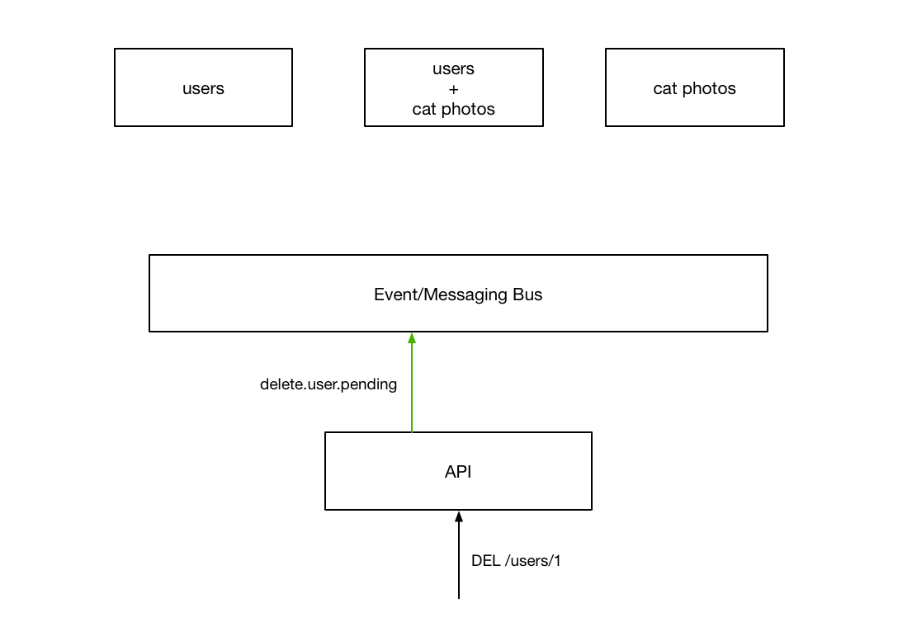
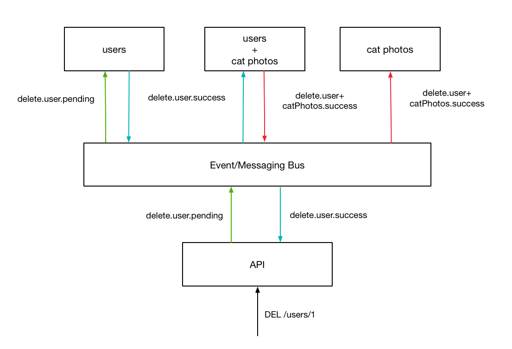

Architecture
==============

Nautilus uses an event-based (also referred to as "event-sourced") architure
that relies on a central messaging system through which all service communicate.
This includes mutations of their various internal states as well as data-retrieval
by the API gateway.

What's Wrong With HTTP For Inter-Service Communication?
--------------------------------------------------------

Nothing. However, When one tries to apply it to a large, distributed application
(as is common today) a few issues start to surface concerning its directed
semantics. To Illustrate this, imagine that we had two services behind our
API gateway:

.. image:: layout.png

Now, if a client wants to send a request to the API in order to delete
a particular user record, they would tradditionally send a ``DELETE`` (or the
equivalent graphql query) to a specific url

.. image:: http_request.png

This request is then routed to a separate backend service which is responsible
for handling the actual logic to be performed.

The question is - How do we tell the other service to remove entries
corresponding to the user we just deleted? One way would be to have that
service keep track of which services are connected to those user, and
send a request to that service to remove them.

.. image:: http_single_cascade.png

This has a few issues. The first of which is that our services are now very
tighly coupled with each other. If something were to change in the target
service (say the format of record's unique id), without updating the user service,
our system would no longer be able to perform the complete action. By "polluting"
our service with assumptions of another, we force ourselves to slow down in order
to ensure our changes aren't going to have un-forseen consequences. This is somewhat
alleviated by the introduction of services that maintain a very small association
between service records - similar to how a join table works in a relational database.

.. image:: http_related_cascade.png

However, this does not fix all of the issues associated with handling related data
stored across many services. In order to pull this off, the user service needs to
maintain a list of all related services so that it can make sure the related records
are also removed.

What Does Nautilus Do Differently?
-----------------------------------

If you think about the problem presented, the core issues stems from the
client/server paradigm of http communication. Because there can only be one
recipient (the server), there can only be a single reponse to any given action.
If you wanted to have many different services to react to the same event, one
must imploy an event-system. While this idea is not new, Nautilus uses this
line of thinking for not just asynchronous tasks but all inter-service communication,
wether it is synchronous or not.

To see how this looks, consider the situation from before:

Now, when the api recieves the request, rather than redirecting the request to the
appropriate service, the API fires an event that will cause the intended behavior
on the backend service.

This action gets sent to all services however, the only one we are interested in
at the moment is the user service so we will just draw that for now.

.. image:: kafka_first_pending_simple.png

After performing the specific action, the server responds with an event, indicating
wether it was successful or not. After recieving this event, the API replies to the
user, terminating the original request.

.. image:: kafka_reply.png

While this seems very similar to the interaction we looked at earlier, there is
a key difference - by performing the synchronous communication over a globally
accessible event system, other services can respond to the successfull event
notifacation to "tidy up" the rest of the system, guaranteeing an
eventually-consistent picture across all of our services.

